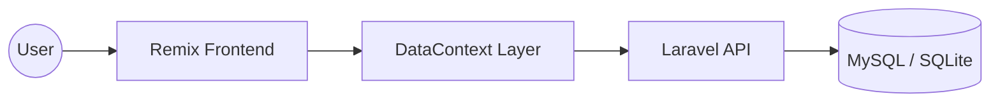

# GweSha HealthTech 🏥

GweSha HealthTech is a modern, full-stack healthcare management platform designed for both patients and clinical administrators. It provides a seamless experience for appointment scheduling, patient record management, and clinical billing.

## ✨ Features

- **Patient Portal**: Self-service appointment booking with specialized doctors.
- **Admin Dashboard**: Real-time calendar synchronization for shift management.
- **Patient Directory**: Persistent database of patient history and records.
- **Billing Console**: Automated invoicing and balance tracking.
- **Real-time Sync**: Global state management ensuring data consistency across all modules.

## 🛠️ Tech Stack

### Frontend
- **Framework**: [React Router v7 (Remix)](https://reactrouter.com/)
- **Styling**: [TailwindCSS](https://tailwindcss.com/)
- **UI Components**: [Shadcn UI](https://ui.shadcn.com/) & [Base UI](https://base-ui.com/)
- **State Management**: React Context with optimized polling.

### Backend
- **Framework**: [Laravel 11](https://laravel.com/)
- **API**: RESTful architecture with Sanctum authentication.
- **Database**: MySQL (XAMPP) & SQLite.

## 🚀 Getting Started

### Installation

1. **Clone the repository**:
   ```bash
   git clone https://github.com/salardegwen-netizen/GweSha-Healthtech.git
   ```

2. **Install Frontend Dependencies**:
   ```bash
   cd health
   npm install
   ```

3. **Install Backend Dependencies**:
   ```bash
   cd backend
   composer install
   ```

4. **Environment Setup**:
   Copy `.env.example` to `.env` in both the root and backend directories and configure your database credentials.

### Development

Start the frontend development server:
```bash
npm run dev
```

Start the backend server:
```bash
cd backend
php artisan serve
```

## 📐 System Architecture

GweSha HealthTech uses a decoupled architecture where the Frontend acts as a single-page application (SPA) communicating with a Laravel API.



## 📝 License

Built with ❤️ by GweSha HealthTech Team.
